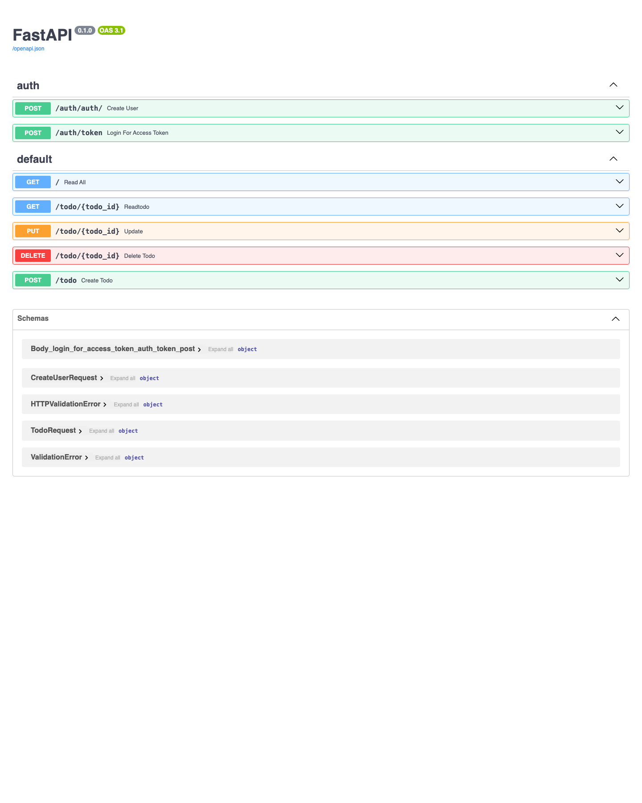

# TodoFastAPI

A small REST API for managing to-do items, built with FastAPI and SQLAlchemy over SQLite. Includes user registration and JWT-based authentication.

> This project was built while following a FastAPI course, as a hands-on way to learn the framework. It is a learning/portfolio project rather than a production service.

## Screenshots

FastAPI auto-generates interactive Swagger documentation at `/docs`:



## What it does

- Create user accounts with hashed passwords (bcrypt).
- Log in to obtain a JWT bearer token (`OAuth2` password flow).
- Create, read, update, and delete to-do items, each with a title, description, priority, and completion flag.
- Persists data in a local SQLite database, created automatically on first run.

## Tech stack

- **Python** with **FastAPI** (web framework)
- **SQLAlchemy** (ORM) over **SQLite**
- **Pydantic** (request validation)
- **passlib[bcrypt]** (password hashing)
- **python-jose** (JWT encode/decode)
- **Uvicorn** (ASGI server)

## Project structure

```
.
├── main.py            # App entry point; creates tables and mounts routers
├── database.py        # SQLAlchemy engine, session, and Base
├── models.py          # Users and Todos ORM models
├── routers/
│   ├── auth.py        # User creation, login, JWT token issuing
│   └── todos.py       # CRUD endpoints for to-do items
└── requirements.txt
```

## Setup

Requires Python 3.10+.

```bash
# 1. Create and activate a virtual environment
python -m venv .venv
source .venv/bin/activate        # Windows: .venv\Scripts\activate

# 2. Install dependencies
pip install -r requirements.txt

# 3. Run the app
uvicorn main:app --reload
```

The API is served at `http://127.0.0.1:8000`. Interactive docs are available at `http://127.0.0.1:8000/docs`.

## API endpoints

### Auth (`/auth`)

| Method | Path           | Description                           |
| ------ | -------------- | ------------------------------------- |
| POST   | `/auth/auth/`  | Create a new user                     |
| POST   | `/auth/token`  | Log in and receive a JWT access token |

### Todos

| Method | Path               | Description             |
| ------ | ------------------ | ----------------------- |
| GET    | `/`                | List all to-do items    |
| GET    | `/todo/{todo_id}`  | Get a single to-do item |
| POST   | `/todo`            | Create a to-do item     |
| PUT    | `/todo/{todo_id}`  | Update a to-do item     |
| DELETE | `/todo/{todo_id}`  | Delete a to-do item     |

## Notes

- The database file (`todosapp.db`) is created automatically at startup and is git-ignored.
- The JWT secret key is currently hard-coded in `routers/auth.py`; for any real deployment it should be moved to an environment variable.
